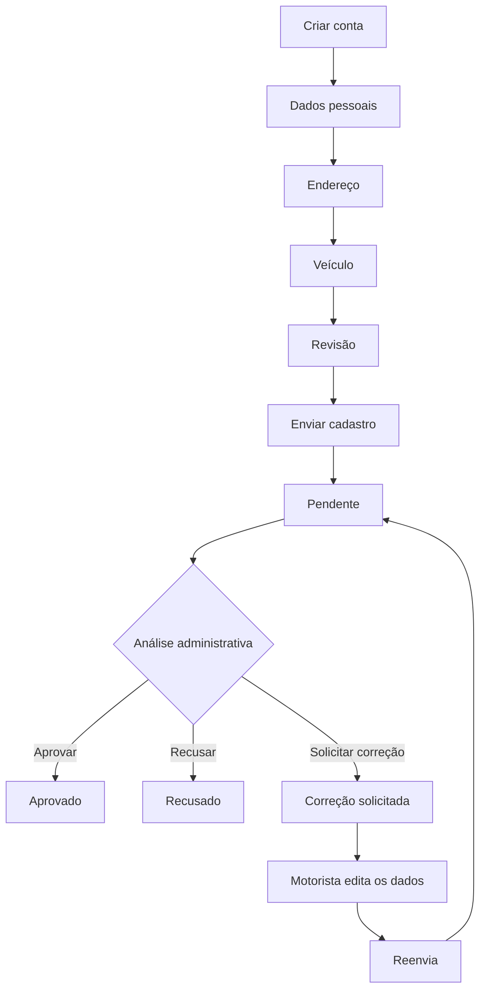

# TransVias — UNALOG

Sistema web para **cadastro, análise e validação de motoristas parceiros** de uma empresa de transporte.

Projeto desenvolvido como MVP utilizando ASP.NET Core MVC, Entity Framework Core e SQLite.

## Funcionalidades

### Motorista
- Criação de conta e login;
- Cadastro em etapas: **Dados pessoais → Endereço → Veículo → Revisão**;
- Validação de campos obrigatórios;
- Revisão dos dados antes do envio;
- Acompanhamento do status do cadastro;
- Visualização de observações da empresa;
- Edição e reenvio quando uma correção é solicitada;
- Logout.

### Administrador
- Login com perfil administrativo;
- Dashboard com totais de **Pendentes, Aprovados e Recusados**;
- Listagem dos motoristas cadastrados;
- Visualização completa dos dados;
- Aprovação;
- Recusa com justificativa;
- Solicitação de correção com observação;
- Área protegida por role.

## Credenciais de demonstração

Para facilitar a avaliação do fluxo administrativo, o projeto possui uma conta de administrador criada automaticamente pelo `DbInitializer`.

```text
E-mail: admin@transvias.com
Senha: Admin123!
```

> Essas credenciais são apenas para demonstração e avaliação. Em produção, credenciais não devem permanecer fixas ou versionadas.

## Tecnologias

- C# / .NET 10
- ASP.NET Core MVC
- Razor Views
- Entity Framework Core
- SQLite
- Bootstrap
- CSS / JavaScript
- Cookie Authentication
- Session
- PasswordHasher

## Arquitetura

```text
Razor View
    ↓
Controller
    ↓
Service
    ↓
Repository
    ↓
Entity Framework Core
    ↓
SQLite
```

Estrutura principal:

```text
TransVias/
├── Controllers/
├── Data/
├── Models/
│   └── Enums/
├── Repositories/
│   └── Interfaces/
├── Services/
├── ViewModels/
├── Views/
├── wwwroot/
├── Migrations/
├── Program.cs
├── appsettings.json
└── TransVias.csproj
```

## Fluxo do cadastro



Durante o primeiro preenchimento, os dados ficam temporariamente em **Session** e só são persistidos no banco após a confirmação na revisão.

Quando uma correção é solicitada, os dados persistidos são carregados novamente nos formulários. Após o reenvio, o status volta para **Pendente**.

## Status do cadastro

| Status | Descrição |
|---|---|
| **Pendente** | Aguardando análise administrativa |
| **Aprovado** | Cadastro aprovado |
| **Recusado** | Cadastro recusado e somente consultável no MVP |
| **Correção Solicitada** | O motorista deve corrigir e reenviar as informações |

## Como executar

### Pré-requisitos

- .NET SDK 10
- Git
- `dotnet-ef`

Caso necessário:

```bash
dotnet tool install --global dotnet-ef
```

Clone o projeto:

```bash
git clone https://github.com/italovsc/TransVias.git
cd TransVias
```

Restaure as dependências:

```bash
dotnet restore
```

Execute:

```bash
dotnet run
```

O `DbInitializer` aplica as migrations e cria o administrador de demonstração caso ainda não exista.

Abra a URL exibida no terminal.

## Banco de dados

O projeto utiliza **SQLite** com Entity Framework Core.

```json
{
  "ConnectionStrings": {
    "DefaultConnection": "Data Source=transvias.db"
  }
}
```

O arquivo `transvias.db` não é versionado. O banco pode ser reconstruído pelas migrations.

Comandos úteis:

```bash
dotnet ef database update
dotnet ef migrations add NomeDaMigration
```

## Autenticação e autorização

A aplicação utiliza **Cookie Authentication** e claims para identificar o usuário e sua role.

```csharp
[Authorize(Roles = "Motorista")]
```

```csharp
[Authorize(Roles = "Administrador")]
```

As senhas são armazenadas com `PasswordHasher<Usuario>` e não em texto puro.

## Validações principais

- E-mail obrigatório e único;
- Senha obrigatória;
- Confirmação de senha correspondente;
- Campos principais obrigatórios;
- Certificação obrigatória quando aplicável;
- Dados do rastreador obrigatórios quando aplicável;
- Observação obrigatória para solicitar correção;
- Motivo obrigatório para recusa;
- Alteração administrativa somente de cadastro pendente;
- Reenvio somente em **Correção Solicitada**.

## Requisitos Funcionais

<details>
<summary>Ver RF01–RF21</summary>

| ID | Requisito |
|---|---|
| **RF01** | O sistema deve permitir que um motorista crie uma conta informando e-mail, senha e confirmação de senha. |
| **RF02** | O sistema deve permitir que usuários façam login utilizando e-mail e senha. |
| **RF03** | O sistema deve identificar o tipo de usuário após o login e direcioná-lo para a área correspondente: Motorista ou Administrador. |
| **RF04** | O sistema deve permitir que o motorista preencha seu cadastro dividido nas etapas **Dados pessoais**, **Endereço**, **Veículo** e **Revisão**. |
| **RF05** | O sistema deve exibir uma tela de revisão com todas as informações preenchidas antes do envio definitivo do cadastro. |
| **RF06** | O motorista deve poder voltar às etapas anteriores para alterar informações antes de enviar o cadastro. |
| **RF07** | O sistema deve permitir que o motorista envie seu cadastro para análise da empresa. |
| **RF08** | Após o envio, o motorista deve possuir um painel no qual consiga visualizar as informações cadastradas e o status atual da solicitação. |
| **RF09** | O sistema deve exibir ao motorista eventuais observações feitas pela empresa em caso de solicitação de correção ou recusa. |
| **RF10** | Quando houver uma correção solicitada, o sistema deve permitir que o motorista edite novamente seu cadastro. |
| **RF11** | Após corrigir as informações, o motorista deve poder reenviar o cadastro para nova análise. |
| **RF12** | O administrador deve possuir um dashboard administrativo acessível apenas por usuários do tipo Administrador. |
| **RF13** | O dashboard deve exibir a quantidade de cadastros **Pendentes**, **Aprovados** e **Recusados**. |
| **RF14** | O dashboard administrativo deve listar os motoristas cadastrados, exibindo informações resumidas como nome, veículo, placa, data e status. |
| **RF15** | O administrador deve poder acessar os detalhes completos de um motorista a partir da listagem. |
| **RF16** | A tela de detalhes deve exibir os dados pessoais, endereço, veículo e status atual do motorista. |
| **RF17** | O administrador deve poder **Aprovar** um cadastro pendente. |
| **RF18** | O administrador deve poder **Recusar** um cadastro. |
| **RF19** | O administrador deve poder **Solicitar correção** de um cadastro. |
| **RF20** | Ao recusar ou solicitar correção, o administrador deve poder registrar uma observação para o motorista. |
| **RF21** | O sistema deve permitir que usuários autenticados encerrem sua sessão através da opção **Sair**. |

</details>

## Regras de Negócio

<details>
<summary>Ver RN01–RN26</summary>

| ID | Regra |
|---|---|
| **RN01** | O sistema possuirá dois tipos de usuário: **Motorista** e **Administrador**. |
| **RN02** | Somente motoristas poderão criar contas através da interface pública. |
| **RN03** | A conta administrativa será previamente cadastrada no sistema e não existirá cadastro público de administradores. |
| **RN04** | Cada conta deve possuir um **e-mail único**. |
| **RN05** | A senha e a confirmação da senha devem possuir o mesmo valor. |
| **RN06** | Após criar a conta, o motorista deverá ser direcionado para a primeira etapa do cadastro. |
| **RN07** | O cadastro somente será salvo definitivamente quando o motorista confirmar o envio na revisão. |
| **RN08** | Não haverá salvamento permanente de rascunho. |
| **RN09** | Cada motorista possuirá apenas um cadastro de parceiro e um veículo nesta versão. |
| **RN10** | Os campos principais serão obrigatórios, exceto os naturalmente opcionais. |
| **RN11** | Se possuir certificação especial, o motorista deverá informar o tipo ou nome da certificação. |
| **RN12** | Se possuir rastreador, deverá informar o tipo e sua empresa/fabricante. |
| **RN13** | O sistema não realizará validação oficial de CPF, CNH, placa, CEP, telefone ou outras informações externas. |
| **RN14** | Todo cadastro enviado deverá receber inicialmente o status **Pendente**. |
| **RN15** | Os status serão **Pendente**, **Aprovado**, **Recusado** e **Correção Solicitada**. |
| **RN16** | Somente um administrador poderá alterar o status de um cadastro. |
| **RN17** | Um cadastro **Pendente** poderá ser alterado para **Aprovado**, **Recusado** ou **Correção Solicitada**. |
| **RN18** | Um motorista com cadastro **Pendente** não poderá alterar suas informações enquanto aguarda análise. |
| **RN19** | Um motorista com cadastro **Aprovado** poderá consultar, mas não editar suas informações nesta versão. |
| **RN20** | Para solicitar correção, o administrador deverá registrar uma observação. |
| **RN21** | Em **Correção Solicitada**, o motorista poderá editar novamente todas as informações. |
| **RN22** | Após corrigir e reenviar, o status deverá voltar automaticamente para **Pendente**. |
| **RN23** | Para recusar um cadastro, o administrador deverá registrar o motivo. |
| **RN24** | Um cadastro **Recusado** será somente consultável. Não haverá novo envio após a recusa no MVP. |
| **RN25** | O motorista poderá visualizar seu status atual e a observação da empresa quando autenticado. |
| **RN26** | Motoristas não poderão acessar páginas administrativas, e administradores não utilizarão o fluxo de cadastro de motorista. |

</details>

## Escopo do MVP

Não fazem parte desta versão:

- Validação oficial de CPF, CNH, placa, CEP ou telefone;
- Upload de documentos;
- Recuperação de senha;
- Envio de e-mails;
- Múltiplos veículos por motorista;
- Novo envio após recusa;
- Edição de cadastro aprovado;
- Gerenciamento de administradores pela interface;
- Integrações com APIs externas;
- Testes automatizados;
- Deploy em cloud.

O backend impede que cadastros **Pendente**, **Aprovado** ou **Recusado** sejam sobrescritos. Apenas cadastros em **Correção Solicitada** podem ser reenviados.

## Cenários testados

Foram testados manualmente:

- criação de conta;
- validação de senhas;
- login válido e inválido;
- cadastro completo em etapas;
- revisão e persistência;
- dashboard administrativo;
- bloqueio de acesso administrativo para motorista;
- solicitação de correção;
- recuperação dos dados para edição;
- reenvio e retorno para pendente;
- aprovação;
- recusa com observação;
- atualização dos contadores;
- logout.

## Build

```bash
dotnet build
```

## Autor

Desenvolvido por **Italo**.
